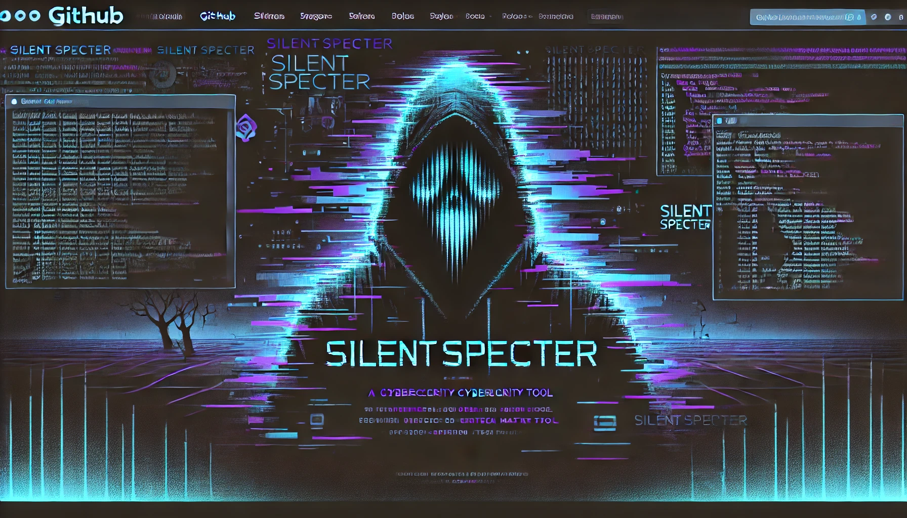

# SilentSpecter: Ethical Remote Access Toolkit


> **SilentSpecter** is a Python-based, modular Remote Access Toolkit (RAT) tailored for ethical hacking, red teaming, and cybersecurity research. It combines stealth, power, and customization into a single lightweight tool — perfect for professionals who need a clean, scriptable remote access platform.

---

## Why SilentSpecter?

SilentSpecter is not your average RAT. It's designed with ethical hackers in mind — built to be auditable, customizable, and professional.

**Key Features:**
- Remote **keystroke logging**
- **Mouse activity** and scroll tracking
- **Webcam** frame capture
- Secure remote control with **token authentication**
- Built on **Pyro4** for scalable remote invocation
- Compatible with **Termux** and **Kali Linux**
- Fully script-based (Python 3), no binary blobs

---

## Preview



---

## Setup Instructions

### Step 1: Install Dependencies
```bash
chmod +x install.sh
./install.sh
```

This installs Python libraries and system dependencies.

### Step 2: Start Server (Listener)
```bash
python3 server.py
```

### Step 3: Run the RAT Agent
On the target (authorized!) system:
```bash
python3 rat/agent.py
```

---

## Built With

- [Python 3](https://www.python.org/)
- [Pyro4](https://pyro4.readthedocs.io/en/stable/)
- [pynput](https://pypi.org/project/pynput/)
- [OpenCV](https://opencv.org/)

---

## Ethical Notice

This project is intended strictly for educational and authorized use **only**. You must have **explicit written permission** from the device or system owner before running this tool.

> Unauthorized use of this software is illegal and unethical. The developers take no responsibility for misuse.

---

## License

MIT License — use it, improve it, share it — ethically.

---

**SilentSpecter** – *by ethical hackers, for ethical hackers.*
